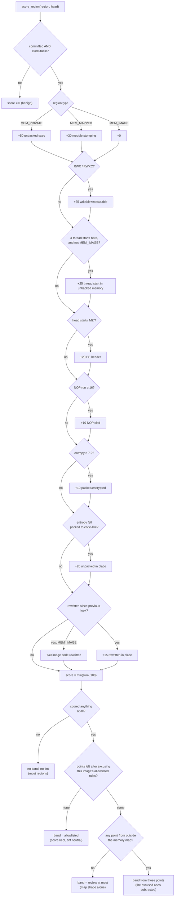
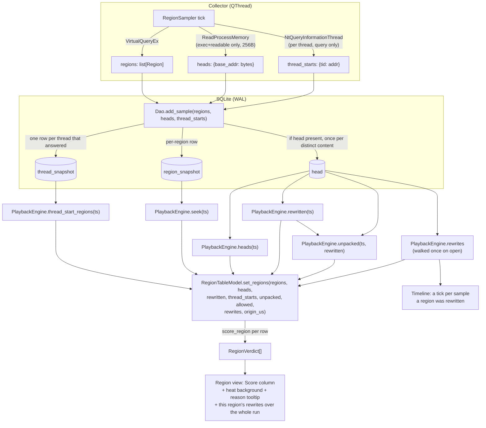

# Memlapse: Architecture

Memlapse is a **memory forensics tool** for Windows: a Process Explorer / System
Informer-style monitor, designed around the distinguishing capability of
**recording and replaying the memory activity of specific threads** in a running
process (process-wide recording and playback are built; the per-thread engine
is Phase 5).

Design constraints:

- **Native GUI** desktop app (PySide6/Qt)
- **Local SQLite** storage
- **Windows** platform
- **Personal but built to last**, clean, testable, extensible layering

---

## Recommended stack

| Concern | Choice | Why |
|---|---|---|
| GUI | **PySide6 (Qt)** | The only Python GUI that comfortably does a live-updating process tree, dockable panels, hex views, and timelines. Process Explorer's whole shape maps onto Qt's model/view. LGPL, fine for personal use. |
| Live plots/timeline | **pyqtgraph** | Built for real-time streaming data inside Qt. matplotlib will choke on live memory graphs; pyqtgraph won't. |
| Process enumeration + coarse stats | **`NtQuerySystemInformation`** via ctypes, with **psutil** for user names and system-wide totals | One syscall lists every process with its thread count and memory counters. Asking psutil per process opens a handle (or scans the whole table) for each one, which cost about a second per poll and starved the GUI thread of the GIL. |
| Raw memory access | **ctypes** (or pywin32) over Win32 | `OpenProcess`, `VirtualQueryEx`, `ReadProcessMemory`, `EnumProcessModules`. ctypes keeps deps minimal. |
| Thread-level memory *activity* | **ETW** via `pywintrace` | The crux of the forensic feature, see "The hard problem" below. |
| Storage | **SQLite** (stdlib `sqlite3`) | Time-series snapshots + event log. WAL mode for concurrent write-while-read. |
| Packaging | PyInstaller (later) | One-file elevated exe when desired. |

---

## The hard problem, stated honestly

Memory on Windows is owned by the **process**, not the thread. So "record the
memory activity of certain threads" has no free API. There are three real ways
to get it, in increasing power and cost:

1. **Sampling / diffing (easy, coarse).** Periodically walk the target's
   regions with `VirtualQueryEx` and snapshot committed/working-set bytes,
   region protections, and (optionally) region *contents* for regions of
   interest. Diff consecutive snapshots to see what grew/changed.
   **Cannot attribute to a thread**, it's process-wide. Good enough for
   "watch this process's heap evolve."

2. **ETW (medium, the sweet spot).** Event Tracing for Windows emits kernel
   events (`VirtualAlloc`/`VirtualFree`, page faults, image loads) and
   **each event carries the ThreadId**. This is how you legitimately say
   "thread 4210 committed 2 MB here." `pywintrace` (a Python ETW library)
   subscribes to the Kernel Memory and PerfInfo providers. Requires admin.

3. **Guard-page / debugger instrumentation (hard, invasive).** Set `PAGE_GUARD`
   on regions and catch `STATUS_GUARD_PAGE_VIOLATION` in a debug loop to log
   every access with the faulting thread. Extremely precise, but slows the
   target dramatically and is fragile. Reserve for a future "deep trace one
   region" mode, not the default.

**Recommendation:** build the collector abstraction so approach **1 is the
baseline** and **2 (ETW) is the forensic engine**, with 3 left as a pluggable
"deep probe" that may never be needed.

---

## Layered architecture

```
┌─────────────────────────────────────────────┐
│  UI layer (PySide6)                          │
│  • Process tree/table (live)                 │
│  • Region/memory-map view + hex panel        │
│  • Timeline scrubber (record ↔ playback)     │
│  • pyqtgraph live graphs                     │
└───────────────▲─────────────────────────────┘
                │ Qt signals (thread-safe)
┌───────────────┴─────────────────────────────┐
│  Application/service layer                    │
│  • RecordingManager (start/stop/annotate)     │
│  • PlaybackEngine (seek to timestamp T)       │
└───────────────▲─────────────────────────────┘
                │
┌───────────────┴──────────────┬──────────────┐
│  Collectors (background)      │  Storage      │
│  • ProcessCollector (NtQSI)   │  • SQLite     │
│  • RegionSampler (VirtualQ.)  │    (WAL)      │
│  • EtwCollector (pywintrace)  │  • schema.sql │
│    → thread-tagged events     │  • DAO        │
└──────────────────────────────┴──────────────┘
                │
        Win32 / SeDebugPrivilege
```

**Threading model that matters for a Qt app:** collectors run on their own
`QThread`s (or a separate process for ETW, which is chatty), and push data to
the UI via Qt signals, never touch widgets from a worker thread. Storage
writes happen on the collector side so the UI thread stays smooth.

Two more rules keep the GUI thread responsive, both learned the hard way:

- **Latest-only delivery.** Queued signals have no backpressure, so a poller
  that emits faster than the GUI consumes builds an unbounded backlog and the
  window eventually freezes. `collectors/base.py` only emits a snapshot once
  the previous one has been dequeued on the GUI thread and drops the poll
  otherwise (`skipped` counts them). The status bar names each stream and its
  count, because a design that discards data quietly is indistinguishable from
  one that loses it (RESEARCH_NOTES.md 7.4). The count reaches the GUI on the
  `dropped` signal, handed over with the next delivered snapshot rather than
  on each drop: a GUI busy enough to drop polls is not draining its queue, so
  announcing every drop as it happened would rebuild the backlog this rule
  exists to prevent. Playback owns the status line while it is on screen, so
  the counts are kept and shown again on the return to live.
- **Keep the GIL free while the GUI works.** Qt's model/view calls back into
  Python thousands of times per refresh (`data()` for sorting, filtering and
  painting), and each callback must take the GIL. A collector that spends most
  of each second in Python-level work makes every one of those callbacks
  wait, which is why the process collector uses one GIL-free syscall instead
  of psutil per process, and why the process model precomputes its display
  strings and sizes its columns only once.

---

## Data model sketch (SQLite)

```sql
recording(id, target_pid, target_name, started_utc, ended_utc, note, allowlist_recorded)
recording_allowlist(id, recording_id, image_name, rule, note)  -- the allowlist the recording was made under
process_snapshot(id, recording_id, ts_us, pid, wset_bytes, priv_bytes, thread_count, can_read, created_ft)
thread(id, recording_id, tid, pid, start_ts, symbol_hint)
thread_snapshot(id, recording_id, ts_us, tid, start_addr)  -- Win32 thread start addresses, per sample
region_snapshot(id, recording_id, ts_us, base_addr, size, protect, state, type, head_hash)
head(hash BLOB PRIMARY KEY, content BLOB)           -- captured head bytes, one row per distinct content
region_blob(region_snapshot_id, content BLOB)        -- legacy: heads from recordings made before `head` existed
mem_event(id, recording_id, ts_us, tid, kind, addr, size, protect)  -- ETW-sourced, thread-tagged
```

- For every *executable, readable* region the sampler captures the first
  `HEAD_BYTES` (256) of content. The bytes go into `head` once per distinct
  content, keyed by SHA-256, and the region row carries the hash in
  `head_hash`. Executable regions rarely change between ticks, so a long
  recording pays 32 bytes per row rather than 256, and the hash is also what
  the content-change detector compares. This feeds the content heuristics in
  ["In-memory injection heuristics"](#in-memory-injection-heuristics-live-memory-malware-detection).
  Recordings made before heads were captured have no blobs and degrade
  gracefully to structural-only scoring; those made before `head` existed keep
  their bytes in `region_blob` and read back through it, without hashes.
  `storage/db.py` adds the `head_hash` column to an older database on open.
- `process_snapshot.can_read` and `.created_ft` describe the sample rather
  than the process: whether the handle that took it could read memory, and
  which instance of the pid answered. Neither can be worked out afterwards,
  which is the whole reason they are stored (see ["A band is about a
  moment"](#a-band-is-about-a-moment)). Without `can_read`, an empty head set
  is ambiguous between "reads were refused" and "nothing executable to read",
  and a replay would report a blind sample as a clean look at the memory.
  Without `created_ft`, nothing downstream can notice that the pid was reused
  between two samples, which the sampler cannot prevent: it opens a fresh
  handle every tick, so a recording can span two processes.
  `Dao.instance_changes` reports the sample timestamps where that happened.
  Both are nullable, and **NULL means "not recorded", never false or zero**:
  a recording made before the columns existed answers "nobody asked", and
  reporting that as a denial would be exactly the confident wrong statement
  the band rule refuses to make. `storage/db.py` adds both to an older
  database on open.
- `mem_event.tid` powers "play back this thread's activity."
- Index on `(recording_id, ts_us)` and `(recording_id, tid, ts_us)`.
- Store `ts_us` as **integer microseconds**, not text.
- Run the DB in **WAL mode** so the UI can read while a collector writes.

---

## Phased roadmap

Each phase is usable on its own.

- **Phase 0, skeleton:** PySide6 window, `requirements.txt`, package layout
  (`memlapse/ui`, `memlapse/collectors`, `memlapse/storage`, `memlapse/model`),
  SeDebugPrivilege helper, "am I elevated?" check.
- **Phase 1, live monitor:** process table from a bulk
  `NtQuerySystemInformation` query, refresh timer, sort/filter. A mini
  Process Explorer on its own.
- **Phase 2, region view:** select a process → `VirtualQueryEx` map + hex read
  of a region, refreshed once a second while the view is on screen.
  Read-only forensic inspection.
- **Phase 3, recording:** RegionSampler writes time-series snapshots to SQLite;
  a timeline widget.
- **Phase 4, playback:** scrub the timeline; UI rebuilds process/region state
  at time T from SQLite.
- **Phase 5, the payoff:** EtwCollector feeds thread-tagged `mem_event`s;
  filter playback to one TID.
- **Phase 6, heuristic detection:** score each region for in-memory code
  injection (unbacked executable memory, RWX, reflective-load PE headers, NOP
  sleds, packing entropy, threads starting outside any image, code rewritten
  in place and payloads that unpack themselves) and surface it in the region
  view. The structural, thread, content and temporal tiers ship today; the
  temporal RW→RX transition detector is the next step. See
  ["In-memory injection heuristics"](#in-memory-injection-heuristics-live-memory-malware-detection).

---

## Key risks to decide on early

- **Elevation:** most useful targets need admin + SeDebugPrivilege. The app
  enables the privilege on startup when it can and relaunches through UAC only
  when started with `--elevate`; the status bar reports whether the process is
  elevated.
- **Antivirus/EDR:** `ReadProcessMemory` + guard pages against arbitrary
  processes looks exactly like malware. Fine on your own box; EDR may flag it.
- **ETW volume:** memory events are a firehose. Needs per-PID filtering and
  batched inserts.

---

## Package layout

```
memlapse/
  __init__.py
  app.py                 # entry point: SeDebugPrivilege, optional UAC relaunch, launch Qt app
  analytics.py           # pure stats (leak rate, z-score, movers) and injection scoring
  model/                 # dataclasses: process.py, region.py, system.py
  collectors/
    base.py              # PollingCollector: QThread loop, latest-only delivery
    process.py           # ProcessCollector over win32/processes.py
    region.py            # VirtualQueryEx RegionSampler (+ head bytes, thread start addresses)
    system.py            # SystemCollector (psutil totals) for the dashboard
    etw.py               # pywintrace EtwCollector (Phase 5, not yet written)
  storage/
    db.py                # connection, WAL setup, idempotent schema apply
    dao.py               # typed read/write helpers
    schema.sql
  services/
    recording.py         # RecordingManager
    playback.py          # PlaybackEngine
  ui/
    main_window.py       # live/playback mode switch, toolbar, tabs
    process_view.py
    region_view.py
    timeline.py
    dashboard.py
    gauges.py
    hexdump.py
    theme.py
  win32/
    privileges.py        # SeDebugPrivilege, elevation
    memory.py            # ctypes wrappers: OpenProcess, VirtualQueryEx, ReadProcessMemory
    processes.py         # ctypes wrapper: NtQuerySystemInformation process table
    threads.py           # ctypes wrapper: NtQueryInformationThread start addresses
tests/
docs/
  ARCHITECTURE.md
  RESEARCH_NOTES.md
```

---

## Dashboard view (vivid near-live surface)

Alongside the forensic monitor, Memlapse has a **Dashboard** tab: a vivid,
near-live overview built to *select, drill-down, interpret, and export*
memory data. It is purely **additive**, it reuses the existing collector
streams rather than introducing a parallel engine, and the forensic monitor
is untouched.

```
QTabWidget (central widget)
  ├─ Dashboard  ──────────────►  DashboardView
  └─ Forensic Monitor  ───────►  QSplitter(ProcessView | RegionView)   (unchanged)
```

Data flow:

```
SystemCollector (QThread, 1 Hz)  ──updated(SystemSample)──►  DashboardView.update_system
ProcessCollector (QThread, 1 Hz) ──updated(list[ProcessInfo])─┬─► MainWindow._on_processes  (monitor)
                                                              └─► DashboardView.update_processes
DashboardView.processActivated(pid,name) ──► MainWindow  ──► switch to Monitor tab + select pid  (drill-in)
```

Pieces:

- **`collectors/system.py`, `SystemCollector`**: shares `ProcessCollector`'s
  polling loop (`collectors/base.py`: own `QThread`, responsive sleep,
  latest-only delivery), emitting a `SystemSample`
  (`model/system.py`) from `virtual_memory()` + `swap_memory()`. This fills the
  one gap in the existing collectors, system-wide totals.
- **`analytics.py`** (dependency-free, no numpy): a `SeriesBuffer` ring buffer
  plus the **interpret** layer, least-squares **leak rate** (bytes/sec →
  MB/min), **z-score** anomaly spikes, and a **top-movers** working-set diff.
  It also hosts the **injection-scoring** primitives (`score_region`,
  `shannon_entropy`, …) described in the next section. Fully unit-tested
  (`tests/test_analytics.py`).
- **`ui/theme.py`**: neon-on-charcoal palette + green→red heat ramp + pyqtgraph
  defaults, plus two stylesheets: `DASHBOARD_QSS`, scoped to the dashboard
  widgets through their object names, and `APP_QSS`, applied to the whole
  application in `app.py` so the forensic monitor shares the dark look.
- **`ui/gauges.py`, `AnimatedGauge`**: 270° arc gauge eased by a ~30 fps render
  timer, decoupled from the 1 Hz data cadence.
- **`ui/dashboard.py`, `DashboardView`**: composes the gauges, a scrolling
  pyqtgraph RAM timeline, a heat-ranked top-process bar list (click → drill-in),
  the interpret strip, and CSV/JSON **export** of the current window.

**Threading note:** all dashboard aggregation happens on the GUI thread from
queued signals; the collectors do the only cross-thread work. No locks.

Natural next steps: per-process USS via `memory_full_info()`, region-select on
the timeline for scoped export, and feeding recorded/played-back samples into
the same view so the dashboard works in playback mode too.

---

## In-memory injection heuristics (live-memory malware detection)

Memlapse scores each memory region for signs of **code injection** and surfaces
the result in the region view. The design follows the technique popularised by
memory-forensics tooling and reverse-engineered EDRs: **find executable memory
that is not backed by a file on disk, then corroborate with content signals.**

The immediate inspiration is the *NyxWatch* write-up[^nyxwatch], a C++
proof-of-concept that walks a process's regions and flags `MEM_PRIVATE`
executable allocations. The same core idea is the basis of the Volatility
Framework's `malfind` plugin[^malfind] and maps directly onto MITRE ATT&CK
**T1055: Process Injection**[^t1055].

### The core signal: unbacked executable memory

Windows tags every region (`MEMORY_BASIC_INFORMATION.Type`) as one of:

| Type | Value | Meaning |
|---|---|---|
| `MEM_IMAGE` | `0x1000000` | Backed by an image file (DLL/EXE) mapped from disk |
| `MEM_MAPPED` | `0x40000` | Backed by a data file / section object |
| `MEM_PRIVATE`| `0x20000` | Anonymous, dynamically allocated (heap, stacks, `VirtualAlloc`) |

Legitimate executable code almost always lives in `MEM_IMAGE`. Injected code
(raw shellcode, reflectively-loaded DLLs, hollowed payloads) typically ends up
**executable *and* `MEM_PRIVATE`** ("unbacked" or "floating" code), because it
was written into memory rather than loaded by the image loader. That single
combination is the highest-signal heuristic in this space.[^malfind]

### The scoring model

`analytics.score_region(region, *, head=b"", rewritten=False,
thread_start=False, unpacked=False, allowed=())` returns a `RegionVerdict`
(`base_addr`, `size`, `score` 0 to 100, `reasons`, `suspicious`,
`effective_score`, `map_shape_only`, `band`). Signals are **additive** and
split into four tiers by what each one needs, the memory map, the thread list,
the region's bytes, or two looks in time:

| Tier | Signal | Points | Needs bytes? | Technique | Rationale |
|---|---|---:|:--:|---|---|
| **Structural** | Executable `MEM_PRIVATE` | +50 | no | T1055 | Unbacked executable memory, the core injection tell[^malfind] |
| Structural | Executable `MEM_MAPPED` | +30 | no | T1055 | Possible **module stomping** (code written over a mapped file) |
| Structural | Writable **and** executable (RWX/RWXC) | +25 | no | none | Self-modifying / stager memory; rare in benign code |
| **Thread** | A thread starts in a committed, executable, non-image region (`THREAD_START_POINTS`) | +25 | no | T1055 | Code with a thread on it; every legitimate thread starts inside a mapped image. Needs no bytes, but the memory map does not answer it either, which is why `MAP_SHAPE_RULES` excludes it |
| **Content** | `MZ` header at offset 0 | +20 | yes | T1620 | PE image in memory → reflective DLL injection[^t1620] |
| Content | NOP sled (≥ `NOP_SLED_MIN` = 16 × `0x90`) | +10 | yes | none | Classic shellcode landing zone |
| Content | Shannon entropy ≥ `ENTROPY_PACKED` = 7.2 bits/byte | +10 | yes | T1027.002 | Packed or encrypted payload[^t1027] |
| **Temporal** | Head rewritten since the previous sample or live refresh, region otherwise unchanged (`REWRITTEN_POINTS`) | +15 | yes | T1055 | Code written into an existing executable region, with no allocation or protection change to see |
| Temporal | The same in a `MEM_IMAGE` region (`IMAGE_REWRITTEN_POINTS`) | +40 | yes | T1055 | Inline hook or module stomping; legitimate image code is not rewritten in place |
| Temporal | Head entropy fell from `ENTROPY_PACKED` to `ENTROPY_CODE_MAX` = 6.5 or below (`UNPACKED_POINTS`) | +20 | yes | T1027.002 | A packed payload that decrypted itself in place; stacks with the rewrite it implies |

Every reason string ends with its technique in square brackets, so the tooltip
an analyst reads names it as ATT&CK does, and any later export of the same
finding will too (RESEARCH_NOTES.md 4.4). Two signals carry none: RWX is a
property of a page rather than a technique, and a NOP sled is a shellcode
artefact ATT&CK does not name. Inventing an identifier for either would make
the rest of the mapping less trustworthy, not more.

The total is capped at 100. Non-committed or non-executable regions
short-circuit to score 0. When `head` is empty (no bytes captured, e.g. an
unelevated live target or a pre-feature recording) the content and temporal
signals are skipped; the structural tier still runs, and so does the thread
tier, which asks the thread list rather than the memory.

Supporting helpers, all pure and unit-tested (`tests/test_analytics.py`):

- `is_executable(protect)`, execute bit set and **not** a guard page.
- `shannon_entropy(data)`, `H = -Σ pᵢ·log₂ pᵢ`, in bits/byte (0.0 to 8.0).[^entropy]
- `longest_nop_run(data)`, longest run of `0x90`.

Every scored region falls in one of four bands, and the band leads the
tooltip because a bare number does not tell an analyst what to do with it.
The top edge was tuned against a JIT-heavy baseline on 2026-09-08 and the
survey is below; the lower edge still rests on the reading in
RESEARCH_NOTES.md 7.1 rather than on a measurement of this machine:

| Band | Score | What it means |
|---|---:|---|
| low | 1 to 29 | Something tripped, not enough to spend time on. Shown and tinted all the same. |
| review | `REVIEW_SCORE` = 30 to 74, **or 75 and above when every point came from the map** | Worth a second look. Most JIT and EDR artefacts land here. |
| likely injection | `LIKELY_SCORE` = 75 and above, **and at least one point from outside the map** | Act on it. |
| allowlisted | any, once an entry excuses every rule that fired | Someone has vouched for this. The row and the score stay; see [the allowlist](#shipped-allowlist-semantics). |

The lower edge is 30 rather than 50 on the reasoning in RESEARCH_NOTES.md
7.1: a commercial platform treats 30 as the point where a detection is worth
forwarding, and a band that starts at 50 leaves the single-signal findings
between them looking identical to noise. Splitting the scale three ways costs
nothing on an additive score that already exists, and the lowest band is
where an analyst learns what their own machine looks like. The fourth band
is not a threshold at all: `allowlisted` is what a region gets when an entry
excuses everything that fired, and it cuts across the other three.

The top edge takes one thing more than the points. `MAP_SHAPE_RULES` names
the three a single `VirtualQueryEx` answers on its own, `private-exec`,
`mapped-exec` and `rwx`, and a region whose whole case is those stops at
**review** however far it clears `LIKELY_SCORE`. The map says a page is
private, executable and writable; it cannot say whether a JIT compiler or a
loader put it there, and on an ordinary desktop the compilers outnumber the
loaders by every region there is. Reaching the top band takes a signal from
somewhere the map cannot see: bytes that matched a content rule, a thread
found starting in the region, or a change between two looks at it. Where a
head was read, that is a statement about the bytes: they came back and said
nothing. Where none could be read it is not, and the difference matters.
A target that denies `PROCESS_VM_READ`, which is any other user's process on
an unelevated run, yields no heads at all, so **no content or temporal rule
can fire for any of its regions**. The same holds replaying a recording made
against one. The top band is not closed off even then: the thread tier asks
the thread list rather than the memory, so private memory with a thread
starting in it still reaches 75 on evidence the map did not supply. What is
lost is everything that depends on the bytes. That is a real limit rather
than a quiet one: the region view says which reason held a row back, and the
live header already says "(no read access, map only)" for the process as a
whole.

This is calibration, not a new heuristic, and it was measured before it was
written. `private-exec` (50) plus `rwx` (25) is exactly 75, exactly
`LIKELY_SCORE`, so that pair alone used to top the scale. Enumerating every
rule set a region can actually produce, it is the only one that reached the
top band without a second kind of evidence. Surveyed unelevated on this
machine on 2026-09-08, across 130 readable processes and 203,388 regions of
which 956 scored at all, it was also the only one that did: all 343 regions
in the top band scored on `private-exec + rwx` and nothing else. The rule
moves every one of them to review and leaves the other 613 scoring regions
exactly where they were.

The alternatives were weighed against the same enumeration and rejected.
Raising `LIKELY_SCORE` to 80 drops 18 rule sets out of the top band, among
them `private-exec + thread-start`: a thread running in unbacked memory with
no RWX anywhere, which is the remote-thread injection tell and the last
thing to give up. Lowering the RWX points to 20 drops 8, including module
stomping that carries a PE header. Asking for one point from outside the map
drops exactly one, the pair itself, and nothing else at all.

The table can now show a 75 in the review band, which reads as a bug unless
the row accounts for it, so a held-back region says so in its tooltip. There
are three ways to arrive there and they are not the same news, so the note
says which:

- `held at review: nothing here but the shape of the map, which is what a JIT
  compiler leaves too`, when the head was read and no content rule matched.
  This is the only one of the three that is evidence of calm.
- `held at review: the signals from outside the map are allowlisted here, so
  only the shape of it still counts`, when a content or temporal rule did fire
  and an entry excused it. Without this the row would list a PE header and
  then claim nothing but the map was found, in the same sentence.
- `held at review: no bytes could be read here, so nothing but the map and the
  thread list had anything to say`, when no head was available at all.

The note appears only where the number and the band disagree, never on a
region that simply scored too little.



### A band is about a moment

One rule governs how the two modes relate, and the rest of this document
leans on it.

**A band answers what was observable at one sample.** Not what has been true
at some point, and not what the recording as a whole knows. It follows that
live mode and playback should reach the **same band for the same moment**,
given the same bytes and the same allowlist. Where they differ today, that is
a defect or a compensation, never a feature.

**Everything else a recording knows goes beside the band, not inside it.**
This is where playback earns its keep, and the argument is about horizon
rather than observation. At sample N the live view knows N-1, N, and whatever
it has accumulated; it cannot know N+1, because nothing can. A recording holds
every sample at once, so it can count, aggregate, look ahead and correlate.
Requiring the two modes to agree on the band costs that nothing, because the
band was never the place those answers belong. Folding them into the band
would instead cap a recording at what a live view could have seen, which is
the one thing worth avoiding.

Two consequences worth stating plainly, because both are easy to get backwards:

- **Playback is not a superset of the live view.** They are separate samplers:
  `RegionSampler` polls on its own `QThread` with its own handle, and the
  region view enumerates independently on a `QThreadPool` thread. A recording
  holds what *its* sampler saw. The advantage is that it holds all of it.
- **Some facts have to be recorded, because they cannot be recovered.**
  Whether the sampling handle could read memory, and which instance of the pid
  answered, are properties of the moment that no later analysis can
  reconstruct. That is why `process_snapshot` carries `can_read` and
  `created_ft`, and why both are nullable: on an older recording they are
  unknown, which is not the same as false. An empty head set means "reads were
  refused" or "there was nothing executable to read", and only `can_read`
  separates them.

Where the model is not yet honoured: the live view carries a rewrite flag
forward across refreshes (see [the content-change
detector](#shipped-content-change-detector)), so its band can say more than
the moment supports. That is a deliberate stand-in for having no timeline. The
way out was to give playback the history display live cannot have rather than
to make playback forget less carefully, and that is what ["Shipped: rewrite
history"](#shipped-rewrite-history) is: playback keeps the flag on the sample
it happened and says beside it what the whole run holds, so it says more than
the live view without any sample of it claiming more than it saw.

### End-to-end data flow

The feature is purely additive over the existing collect → store → replay
spine; each stage feeds the next with no new engine.



**Collection**, `collectors/region.py`. The sampler opens the target with
`want_read=True` (falling back to map-only if unelevated) and, via
`RegionSampler._read_heads`, reads the first `HEAD_BYTES` (256) of each region
that is **executable *and* readable**. Reading only the head of only the
executable regions keeps the extra `ReadProcessMemory` cost bounded, a handful
of small reads per tick, not a full address-space dump.

**Storage**, `storage/dao.py`. `add_sample(..., heads=None)` hashes each
captured head, inserts it into `head` if that content is new, and writes the
hash on the region row. `heads_at(recording_id, ts_us)` reads the bytes back
for the anchored sample (same "latest at or before *T*" semantics as
`regions_at`), falling back to the legacy `region_blob` table for rows that
predate hashing; `head_hashes_at` returns only the hashes, which is all the
content-change detector needs.

**Replay**, `services/playback.py`. `PlaybackEngine.heads(ts_us)` is kept
separate from `seek()` so the latter's `(state, regions)` tuple contract is
unchanged.

The region view also offers **Save region bytes** on a right-click in live
mode, which writes up to `REGION_DUMP_MAX` of the selected region so the
payload can go to a disassembler or a YARA rule (RESEARCH_NOTES.md 4.1).
It is a read, like everything else here.

The save, the hex preview and every live refresh check that the pid still
names the process the map came from, by comparing
`ProcessMemory.creation_time()` against the value captured with the map.
Windows reuses pids, and an analyst can take a while between selecting a
process and asking for its bytes; without the check a target that exited in
between could hand back bytes belonging to whatever inherited its number,
filed under the old selection. The comparison happens with the handle already
open, which is what keeps the pid from being recycled between the check and
the read. A refresh that finds a different instance ends the watch rather than
adopting the new map: comparing a stranger's heads against the watched
process's would report every difference as code rewritten in place, which is
the loudest thing this view can say. The save writes through a temporary file
in the destination directory and renames onto the target, so a failure part
way through cannot truncate a file that was already there.

**Surface**, `ui/region_view.py`. `RegionTableModel` gained a **Score**
column. On `set_regions(rows, heads, rewritten, thread_starts, unpacked,
allowed, rewrites, origin_us)` it computes a `RegionVerdict` per row and:

- shows the numeric score (blank for benign rows),
- tints suspicious rows via `theme.heat_color(score/100)` (green→amber→red,
  translucent so text stays legible on the dark theme), and
- exposes the human-readable `reasons` as the row tooltip, followed by what
  the open recording knows about that region over the whole run (["Shipped:
  rewrite history"](#shipped-rewrite-history)). The last two arguments carry
  that history and are playback's alone to pass; a row with no verdict and a
  history still gets a tooltip, and a row with neither gets none.

Both modes score with the full content signals: live mode reads the head of
each executable region on the pool thread alongside the map, playback reads
the stored heads. Both also carry the temporal signals below, the rewrite and
the entropy fall alike, live mode from one refresh to the next and playback
from one sample to the next. Live mode keeps the previous refresh's head
bytes to do it, 256 bytes per executable region, which is under 200 KiB for
the largest process measured on this machine.

### Threading & performance notes

- Memory reads happen on the **sampler `QThread`** when recording and on the
  **`QThreadPool` task** that enumerates the live map, consistent with the
  project rule that storage/IO stay off the GUI thread. Thread start
  addresses cost one system-table query plus a handle open per thread, so
  they are read in the same two places, never on the GUI thread. The live
  view re-enumerates once a second (`LIVE_REFRESH_MS`) but only while it is
  on screen and only when the previous load has finished, the same no-backlog
  rule the collectors follow.
- Storage cost: 32 bytes per *executable* region per tick for the hash, plus
  256 bytes once for each distinct head content. A region whose code does not
  change costs nothing new after its first sample, however long the recording.
- Each seek in playback now reads the previous sample's region list and head
  hashes as well as the anchored sample's, so a scrub costs about three region
  reads per step instead of one. The hashes query touches no blob content.
- Opening a recording walks it once for the rewrite history, on the GUI
  thread, which is 58 ms for a two minute recording and 573 ms for a ten
  minute one (measured in ["Shipped: rewrite
  history"](#shipped-rewrite-history) below). The walk is linear in the
  recording, so that is a stall that keeps growing: an hour of samples pays
  about six times the ten minute figure. It is a one-shot cost on a
  deliberate action rather than a repeated one, which is why it sits on the
  GUI thread at all; a recording long enough for the wait to be intolerable
  is the point at which it has to move to a worker with its own connection
  and arrive by signal. A seek costs nothing more afterwards: the tooltip
  and the timeline marks both read the dictionary that pass built.
- Scoring is O(head length) per region and runs on the GUI thread only at
  `set_regions` time (per seek or per live refresh), which is negligible. The
  live change detector compares head bytes directly rather than hashing them,
  and the entropy rule measures only the regions that changed on that
  refresh, which is what keeps it affordable: a process that rewrote no
  executable head since the last refresh costs it nothing at all. Measured
  2026-09-08 on this machine, the largest process sampled held 716 executable
  regions and changed none of them in a second; entropy over all 716 in one
  tick, which needs every head to change at once, was 10 ms.

### Limitations & known evasions (stated honestly)

This is a **heuristic triage aid, not a verdict engine.** The same caveats the
NyxWatch author acknowledges apply here:

1. **JIT false positives.** .NET, the JVM, and JavaScript engines (V8) legally
   allocate private, executable (sometimes RWX) memory for generated code. A
   naive scan lights them up, and this one did: measured unelevated on this
   machine on 2026-09-08, every region that reached the likely injection band
   with nothing malicious running got there on `private-exec + rwx` alone.
   Two things answer that now and they answer different halves of it. The
   [band rule](#the-scoring-model) empties the top band of the whole class,
   without a list and without knowing which processes are JIT hosts, by
   declining to escalate on the shape of the map alone. The
   [allowlist](#shipped-allowlist-semantics) then moves a named host's rows
   out of review as well, which the band rule cannot do, since a JIT arena is
   a real observation and review is a fair place for it.
   What neither does is tell a JIT arena from a payload on the evidence; the
   band rule declines to guess and the allowlist is told the answer. The
   allowlist is still a list someone has to write and keep, and it is still
   keyed on an image name, so it excuses anything that adopts one.
   Behavioural context remains the stronger answer.
2. **RW→RX flip evasion.** Mature loaders allocate `PAGE_READWRITE`, write the
   payload, then `VirtualProtect` to `PAGE_EXECUTE_READ`, never holding RWX. A
   single snapshot can miss this. The **temporal** detector below closes it.
3. **Module stomping into `MEM_IMAGE`.** Overwriting a legitimately-mapped image
   defeats the "private" check; the +30 `MEM_MAPPED` rule only partially covers
   the mapped-file variant.
4. **Snapshot/polling model.** `VirtualQueryEx` + `ReadProcessMemory` sampling
   is a point-in-time, racy, user-mode view. A kernel callback or ETW
   Threat-Intelligence source sees the *allocation/protection-change event*
   itself and is far harder to evade, consistent with this doc's
   ["hard problem"](#the-hard-problem-stated-honestly) framing.
5. **Thread starts that land in an image.** The thread-start signal only
   fires for a start address outside any image, so the oldest trick of all,
   `CreateRemoteThread` on `LoadLibraryA` in `kernel32`, does not trip it.
   The loaded module is what gives that one away, which is the mapped-file
   work in RESEARCH_NOTES.md 1.1. The signal also needs elevation to see
   another user's threads; without it the addresses are simply unknown and
   the rule stays silent rather than guessing.

### Shipped: content-change detector

The first temporal signal. `analytics.rewritten_regions(prev_regions,
prev_hashes, curr_regions, curr_hashes)` returns the base addresses of regions
that are committed and executable in both of two consecutive samples with the
same base, size and protection, whose captured heads both exist and whose
hashes differ. A head missing on either side means the comparison cannot be
made, not that the bytes changed, and a region that appeared, grew or changed
protection is left to the allocation and transition signals.

`PlaybackEngine.rewritten(ts_us)` runs it between the anchored sample and the
one before it, and the region view passes the result into `score_region` as
the `rewritten` flag, which adds `REWRITTEN_POINTS` (15) to a private or
mapped region and `IMAGE_REWRITTEN_POINTS` (40) to an image region. The
asymmetry is deliberate: JIT engines rewrite private code all day, so that
case only nudges a region that already scores, while image code is never
legitimately rewritten in place except by an inline hook. Forty points puts a
bare image region that was rewritten in the **review** band and nowhere near
**likely injection**, which is the right place for it: the hooks an EDR puts
in `ntdll` on every process are worth recognising once and never worth
escalating.

This is the detector the Trovent write-up in RESEARCH_NOTES.md motivates: an
injector that overwrites an existing RWX region never allocates and never flips
a protection, so the changed bytes are the only trace it leaves.

Live mode runs the same function between one refresh and the next, keeping the
previous refresh's regions and head bytes in memory. A live monitor has no
scrub-back, so a change that showed for one tick and vanished would be a
detector nobody sees: a region seen rewritten stays flagged, and counted in
the header as "rewritten while watching", until it leaves the map or the
analyst selects a process again, which starts the history afresh.

**Playback does not carry it forward, and that is the intended shape.**
`PlaybackEngine.rewritten` compares the anchored sample with the one before it
and nothing else. The flag belongs to the moment it happened, and a mode that
can scrub can take the analyst to that moment. The live carry-forward is the
compensation, not the standard: it exists because the live view has no
timeline to send anyone back to, so a change that showed for one tick and
vanished would be a detector nobody sees. Read the two behaviours that way
round and they stop looking like a disagreement.

The rule this settles is in ["A band is about a
moment"](#a-band-is-about-a-moment): the band answers what was observable at
one sample, so both modes should reach the same band for the same sample, and
everything a recording knows beyond that sample belongs beside the band rather
than inside it. Live's stickiness is the one thing that currently breaks that
rule, and it breaks it in the direction of saying more than the moment
supports.

That left a real limitation: **a one-shot rewrite is band-visible in a replay
only at the sample it landed on**, and nothing on the timeline marked which
sample that was. The answer was never to make playback sticky, which would
cost the scrub-back that makes playback worth having. It was to show the
history alongside the band, which only a recording can do at all. See
["Shipped: rewrite history"](#shipped-rewrite-history).

### Shipped: rewrite history

The history a recording holds and a live view cannot: how many times each
region was rewritten across the whole recording, and at which samples. It is
the worked example of ["A band is about a
moment"](#a-band-is-about-a-moment), showing beside the band what the band
itself must not absorb, and it closes the gap the content-change detector
leaves, where a one-shot rewrite is band-visible only at the sample it landed
on.

Nothing new is captured. `region_snapshot` already holds
`ts_us, base_addr, size, protect, state, head_hash` for every region of every
sample, so the whole recording was already there to be read.

`Dao.region_samples` walks it once, yielding one `(ts_us, regions, digests)`
per sample, and `PlaybackEngine.rewrite_history` hands each consecutive pair
to `rewritten_regions`, the same function one seek uses, filing each change
under the later of the two samples. `open()` runs it once and keeps the
result on `PlaybackEngine.rewrites`.

**Two things the whole-run view has to be careful about that one seek does
not.** A count and a tick are shown at every sample of the recording, so a
wrong one is on screen the entire time and at samples where the header's
warnings have nothing to say yet.

- **It is keyed on `analytics.region_identity`, not on the base address.**
  Base, size, protection and state together, which is exactly what
  `rewritten_regions` requires of a pair before it will call a change a
  rewrite. An address is not a region: Windows reuses virtual addresses, so
  one allocation can be freed and another put at the same base later in the
  same recording, and a history kept by address would show the first one's
  rewrites on the second one's row. The price is that a region whose
  protection changes starts a fresh history, since it is a fresh identity;
  that is the safe direction, and a protection change is its own signal.
- **It restarts at a pid reuse.** `Dao.instance_changes` reports the samples
  where `created_ft` changed, and the walk drops what it was holding at each
  of them, because the sample before belongs to a different process that
  happened to hold the same number. `PlaybackEngine.rewritten` declines the
  same comparison, so the flag and the history still agree everywhere. The
  live view refuses this by ending the watch when a refresh finds another
  instance; a recording cannot end, so it declines the one comparison.

**Why the pass is in Python rather than a `LAG` window.** The SQL was
prototyped first and its cost measured, and the numbers were fine. What
decided it was that the window function has to restate what a rewrite *is*,
in SQL: same base, size, protection and state, committed and executable on
both sides, a head on both sides, and the two heads different. That is a
second copy of `rewritten_regions` in another language, and the copy that
drifts is the one no test runs. Feeding pairs to the original costs one pass
and keeps one definition.

The subtlety the SQL prototype handled by ranking samples and requiring the
previous row to be `n - 1` is the same either way, and it is worth stating
plainly because it is easy to lose: **a region absent for a sample and back
with different bytes is not a rewrite.** It is an allocation carrying whatever
it carries. So `region_samples` yields every sample the recording has, empty
when nothing in it survived the filter, and a pass that skipped the empty ones
would join their neighbours into a pair they are not. `test_playback.py`
builds that shape and asserts the pass and a single-seek `rewritten()` agree
that nothing was rewritten.

Cost, measured on this machine on 2026-09-09, best of three, over synthetic
recordings of the two shapes below:

| Recording | Rows | Every row read | Filter pushed into the query |
| --- | ---: | ---: | ---: |
| 2 min, 800 regions | 96,000 | 255 ms | **58 ms** |
| 10 min, 1,500 regions | 900,000 | 2,668 ms | **573 ms** |

The push-down is what makes it affordable, and the difference is a stall on
open rather than a micro-optimisation. Only committed, executable, non-guard
rows carrying a head are fetched, about a seventh of the table. Narrowing the
read cannot change the answer: every row it leaves behind is one
`rewritten_regions` would have refused on both sides of the comparison. The
query is told which rows those are rather than knowing itself, and what it is
handed is `analytics.EXEC_MASK`, so "executable" has one spelling rather than
one per language. An index on `(recording_id, base_addr, ts_us)` does not
help; that was measured for the SQL version and does not need re-deriving.

What the analyst sees, in the two places a recording can speak:

1. **The Score column tooltip** names the count and the most recent time, as
   "rewritten 3 times in this recording, most recently at 00:04:11", read
   against the recording's own first sample so the clock matches the timeline
   that scrubs to it. It appears on a row that scores nothing as readily as on
   one that scores well, which is the point of it: the region rewritten four
   minutes ago is quiet now, and an empty Score cell beside it reads as a
   region with nothing to say. `describe_rewrites` in `services/playback.py`
   is the wording, kept out of the widget so it can be tested without Qt.
2. **Ticks on the scrubber**, `TimelineWidget.set_marks()` and
   `MarkedSlider.paintEvent`, so the samples worth seeking to can be seen
   rather than only read about. A mark is a sample index, and the tick is
   painted where the style itself puts the handle for that value, because a
   tick a few pixels off is worse than no tick: it gets followed, it lands on
   the neighbouring sample, and the region looks quiet after all.

Neither touches a score. The band still answers for one sample.

### Planned: temporal RW→RX transition detector

Because Memlapse *records over time*, it can do something a single-snapshot tool
cannot: diff a region's `protect` across consecutive samples and fire when a
private region transitions **`PAGE_READWRITE` → `PAGE_EXECUTE_READ`**. That is
the exact "allocate-RW, write payload, flip-to-RX" pattern EDRs watch for, and
it directly addresses evasion (2) above. The planned entry point is
`analytics.score_transition(prev_region, curr_region)`, scored over the
playback timeline, the feature that makes Memlapse *exceed* the source technique
rather than merely reimplement it.

The rule states its window explicitly rather than implying "consecutive
samples" ([RESEARCH_NOTES.md](RESEARCH_NOTES.md) 7.2), and carries three
parameters: an **outer window** both steps must fall inside, a **maximum gap**
between one step and the next, and a **threshold per step**. Consecutive samples
are then one configuration of the rule rather than its definition, which matters
twice over. A recording sampled every second and one sampled every thirty would
otherwise mean different things by "the next sample", and a loader that
allocates RW, waits for the user to click something, and flips to RX a minute
later is the same pattern stretched over a gap that consecutive-sample logic
cannot express.

### Shipped: allowlist semantics

`analytics.Allowlist` holds `AllowlistEntry(image_name, rule, note)` and
answers `rules_for(image_name)` with the rule ids exempted for that process.
The region view looks that up once per live refresh and hands the ids to
`RegionTableModel.set_regions`, which passes them to `score_region` as
`allowed`. It suppresses a verdict, never a row, following the rules a
commercial platform uses ([RESEARCH_NOTES.md](RESEARCH_NOTES.md) 7.1 and 7.3):

- **Keep the row and the raw score.** An allowlisted rule still fires and still
  appears in the reasons, marked "(allowlisted)" in the tooltip.
  `RegionVerdict.score` is untouched and the table still shows it. What changes
  is `effective_score`, the sum of the rules that were not excused, and the
  band comes from that, as does the heat tint. A region left with no points
  at all bands as `allowlisted` and is tinted neutral grey instead of by
  heat; since every rule scores something, that is the same as every rule
  that fired having been excused. Filtering the row out would hide the one
  thing an analyst reviewing a false positive needs to see.
- **Scope it to one heuristic.** An entry names exactly one rule. Exempting a
  JIT host from `private-exec` and `rwx` leaves `pe-header`, `nop-sled` and the
  rest counting, so a stomped CLR still scores on its content and keeps its
  row and its raw number. Note what that is worth: `pe-header` alone is 20
  against a `REVIEW_SCORE` of 30, so an `MZ` in an excused host lands in
  **low**, not review, and it takes a second content rule to ask for an
  analyst's time. The entry cannot hide the row, but on one content signal it
  does cost it a band.
- **Make removal restore the verdict.** Nothing is recomputed or discarded, so
  deleting an entry brings the original band back with no history to replay.
  That falls out of the arithmetic rather than being a feature: a score is the
  sum of its reasons' points, so an excused rule is subtracted, never erased.
- **Every rule has a stable id.** `RULE_PRIVATE_EXEC` and its siblings are the
  vocabulary an entry is written in, and they will key rows in a recording, so
  a shipped id is schema and is never renamed. The prose beside it is free to
  change.
- **The header agrees with the bands.** The count of regions "rewritten while
  watching" comes from the verdicts rather than from the change set, so the
  header cannot announce a finding the allowlist has already excused.
- **Both modes look an entry up the same way.** `show_recorded_regions` takes
  the recorded process name and resolves it exactly as the live view resolves
  the process it is watching, so an entry means the same thing in a replay as
  in the watch that made it. Before this, a replay scored against an empty
  allowlist while the watch scored against the real one, and the two
  contradicted each other on the same region.

  This is one instance of the wider rule in ["A band is about a
  moment"](#a-band-is-about-a-moment): the two modes should reach the same
  band for the same sample, and an entry that meant one thing live and another
  on replay broke that. One departure from the rule remains, and it is not
  about entries: the live view carries a rewrite forward (see [the
  content-change detector](#shipped-content-change-detector)) while playback
  compares only the anchored sample with the one before it. That one is live
  standing in for a timeline it does not have.

Measured on this machine on 2026-09-08, unelevated, with entries for ten
common JIT hosts on `private-exec` and `rwx` only: regions in the likely
injection band fell from 996 to 33 across every readable process, and 1015
landed in the allowlisted band. The review band barely moved, 396 to 345,
because it is mostly `mapped-exec` on .NET images, which is a different
problem this does not claim to solve. The absolute counts depend on what is
running; the before and after come from the same survey.

That measurement predates the band rule above and is left as it stands,
since it is what the allowlist does on its own. The two now divide the work,
and the survey in the scoring section shows how. Of the 343 regions the band
rule moves out of the top band, the allowlist goes on to quiet 281
completely, into `allowlisted`; the remaining 62 stay in review, because
they belong to processes nobody put on the list. The allowlist also reaches
61 regions the band rule never touched, which were in review all along, for
342 allowlisted in total.

Neither subsumes the other, and the reason is worth keeping in view. The
band rule needs no list, so it is the half that covers a host nobody thought
to name. On that survey those 62 regions belonged to four processes none of
the ten entries mention, `SourceTree.exe` and a Lenovo service accounting
for 60 of them, and the band rule is the only thing that kept any of them
out of the top band. The allowlist is the half that can quiet a row
completely, which the band rule will not do, because a JIT arena really is
private executable memory and review is an honest place to leave an
observation nobody has vouched for.

### Shipped: the allowlist travels with the recording

`create_recording` writes the entries in force into `recording_allowlist`,
and a replay scores with those rather than with whatever the reader has
configured. Open a recording on another machine and the same rules are
excused, which is what makes it a finding someone else can check rather than
one that depends on the reviewer's own setup.

The read is `Dao.allowlist_for`, and it answers three states, not two:

- **An allowlist with entries.** The recording says what it excused, and the
  replay excuses exactly that.
- **An allowlist with no entries.** The recording says it excused nothing,
  and the replay excuses nothing. This is a real answer.
- **None.** Nobody wrote a list down, which is every recording made before
  the column existed. Only then does the currently configured allowlist
  score the replay, which is how every replay behaved before this shipped,
  so no existing recording changes its bands. The playback header says so
  when it makes a difference.

The last two are the same zero rows in `recording_allowlist` and opposite
instructions, which is why `recording.allowlist_recorded` carries the flag.
It is the same rule as `can_read`: NULL means "not recorded", never false.

That distinction has a sharp edge in code. `Allowlist.__bool__` reports
whether it holds entries, so a recorded allowlist that excused nothing is
falsy while still being the answer. Every choice between a recorded list and
the configured one is written `is None`, never as `or`; written as `or`, a
recording that excused nothing would silently be scored with the reader's
list instead.

### Planned: the rest of the allowlist

- **A durable key.** Entries are keyed on the process image name, which the
  bulk query returns without a handle and a recording already stores. A name
  alone excuses anything that adopts it; an image path plus its publisher, or
  a head hash, is the intended upgrade. A PID is never a key, since Windows
  reuses those within minutes.
- **An affordance to create one.** There is no UI to add or delete an entry
  yet. `MainWindow` owns the one `Allowlist` that the live view scores
  against and that a recording writes down, so an editor has one place to
  write to, but until it exists a recording made by the app stores an
  allowlist with no entries in it.

### References

A wider reading of the memory-forensics and fileless-malware literature, with
the feature ideas it suggests for later phases, is in
[RESEARCH_NOTES.md](RESEARCH_NOTES.md).

[^nyxwatch]: *NyxWatch: A Deep Dive into Live Memory Malware Detection (Part I)*,
    DFIR_rdk, Medium. <https://medium.com/@DFIR_rdk/nyxwatch-a-deep-dive-into-live-memory-malware-detection-part-i-4b33fcfa9fb2>
[^malfind]: The Volatility Framework's `malfind` plugin detects potentially
    injected code by locating executable, private (non-file-backed) memory
    regions and inspecting them for PE (`MZ`) headers. Volatility Foundation,
    <https://www.volatilityfoundation.org/>.
[^t1055]: MITRE ATT&CK, *Process Injection* (T1055), including the *Reflective
    DLL/PE image* variants. <https://attack.mitre.org/techniques/T1055/>.
[^t1620]: MITRE ATT&CK, *Reflective Code Loading* (T1620), loading code into a
    process without going through the Windows loader.
    <https://attack.mitre.org/techniques/T1620/>.
[^t1027]: MITRE ATT&CK, *Obfuscated Files or Information: Software Packing*
    (T1027.002). <https://attack.mitre.org/techniques/T1027/002/>.
[^entropy]: Shannon entropy (C. E. Shannon, *A Mathematical Theory of
    Communication*, 1948) measured over bytes ranges 0 to 8 bits/byte; packed
    or encrypted data approaches the 8.0 maximum, which is why a high
    threshold (~7.0 to 7.2) is a common packing indicator. Memlapse uses
    `ENTROPY_PACKED = 7.2`.